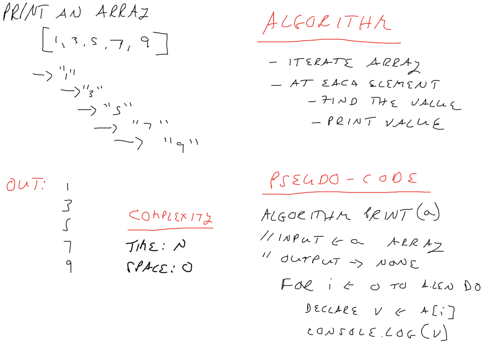

# Print an Array

<!-- Short summary or background information -->

## Challenge

Print an array in javascript, without using built-in methods

## Approach & Efficiency

- Iterate the array with a for loop
- At each element, use `console.log()` to print the value

Big O:

- Time: O(n)
- Space: O(1)

## Solution
<!-- Embedded whiteboard image -->

